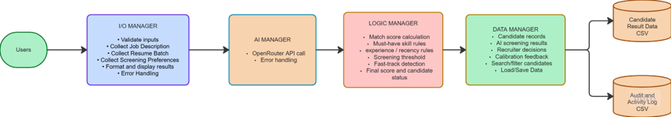

# Project Initial Details
## AI-powered Resume Screener

**Lab-P2 GROUP 2**

**Team Members:**
- Kaushik
- Samuel
- Roy
- Jereson
- Melvyn
- Ritchie

**Repository URL:** https://github.com/GovindarajKaushik/Group1-ResumeScreener.git

---

## 1. Problem Statement and Target Users

### Problem Statement

Hiring managers and HR teams spend hours manually reading through unstructured resumes to extract key qualifications and rank candidates. Simple keyword searches often fail because they miss context or misinterpret candidate experience, resulting in huge time consumption.

HR recruiters often receive a high volume of resumes for one position and have to review each manually. They need to extract the relevant information from each resume and match it to the requirements specified in the job description. This process is tedious and time-consuming since every resume has to be read and understood even with an Applicant Tracking System (ATS). Keyword search in resumes also does not work well, as it favours applicants who use the same terms as the job description. This leads to two problems:

1. Qualified applicants with slightly different wording than the job description may get filtered out.
2. The shortlisting process becomes inconsistent between reviewers.

Our application solves this by allowing users to quickly extract relevant information about candidates and compare it to a specific position's requirements using an AI-based approach. This enables users to evaluate applicants more efficiently and thoroughly since it goes beyond the simple keyword matching used by current applications in the market. This helps users identify qualified candidates who would have otherwise been overlooked due to differences in wording or human error.

### Target Users

Recruiters, hiring managers, and talent acquisition teams.

The primary users for this application are corporate recruiters, hiring managers, and talent acquisition teams who are responsible for incoming applications for one or more open roles. These users typically work with a high volume of resumes per posting and need to make fast but defensible shortlisting decisions. The tool is designed to fit into their existing workflow: they upload what they already have (job description and the batch of resumes) and receive an organized, ranked, explainable output in return.

---

## 2. User Inputs

- **Job Description:** job title, required skills, minimum years of experience, education requirements, and preferred qualifications — entered as text or uploaded as a document.
- **Candidate Resumes:** batch of resumes in a folder, uploaded as PDF or DOCX files.
- **Screening Preferences:** optional weighting across criteria and a minimum qualifying score.
- **Feedback to AI:** recruiter marks an AI-generated ranking on a range (e.g. 1–10). This is logged to refine the approach over time.

---

## 3. Use of AI

Every applicant's record passes through the AI API (OpenRouter), which receives all user input and screening preferences. The AI then performs resume understanding and semantic comparison, recognizing that equivalent skills may be described with different terminology rather than relying on exact keyword matching. A structured prompt is sent to the AI API, combining:

- **Job Description:** from user input.
- **Extracted resume content:** from each specific candidate (plain text pulled from the PDF or DOCX file, processed in the input/output manager).
- **Set of screening instructions:** screening preferences from user inputs and prompts that tell the AI exactly what to evaluate and what output format to return.

### AI-Generated Outputs

- **Overall match assessment:** strong match, partial match, weak match (in terms of percentage).
- **Skill and experience comparison:** which required/preferred skills are present, which are missing, and how the candidate's experience lines up against what the role needs.
- **Evidence:** short explanation from the resume that justifies the assessment, so HR can see why the AI reached its conclusion, not just a number.
- **Overall assessment and confidence:** a summary label plus how confident the AI is in the result.

---

## 4. Business Rules

| Business Rule | Description |
|---|---|
| Score Routing | If a candidate's AI-generated score is below the minimum threshold set by the recruiter, the candidate will be placed in a secondary list for review instead of being discarded completely. |
| Fast-Track | Scores above a certain percentage (e.g. 90%+) receive a special tag. |
| Keyword Weightage | Resumes that contain must-have skills receive extra points to boost their AI match score. |
| Recency of Experience | Skills not used within a certain number of years (e.g. 5+ years) have their weightage reduced by a certain percentage. |
| Fairness Safeguard | Before any resume data is transmitted to the third-party AI API, the system will strip all sensitive and identifying information (e.g. candidate photo, age, gender, race, marital status). This ensures fairness and prevents sensitive data from being sent to third parties. |
| Human Confirmation | AI-generated rankings will not be treated as the final decision. The user must explicitly choose shortlisted candidates, as the AI will only rank, label, and separate candidates according to their scores. |
| Audit Logging | The system will create logs and timestamps for every action performed by the user, creating a traceable screening history. This ensures greater transparency. |
| Input Validation | Uploaded resume files will be validated for file format, size limits, and empty contents before submission to the AI service. Files that fail validation will be rejected, and the user will be prompted again with a clear, descriptive error message. |
| API Call Failure Handling | If the AI API request/response fails or returns invalid data, that specific resume is marked for re-entry. |

---

## 5. High-Level Architecture
